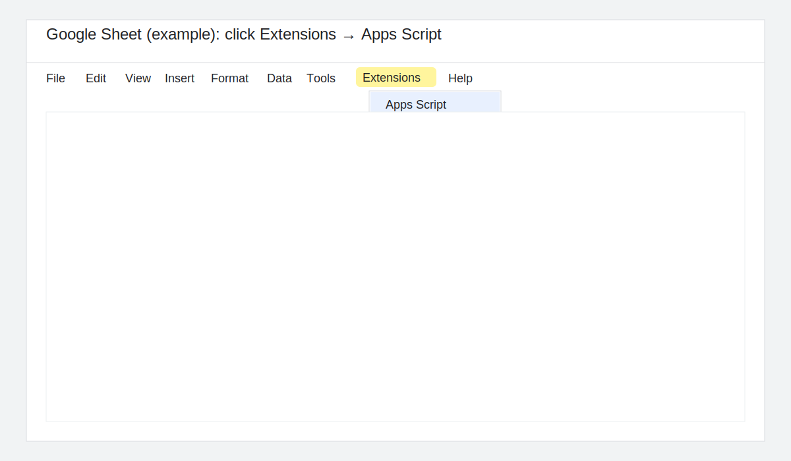
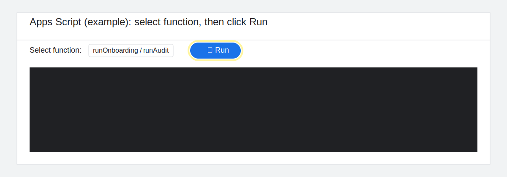

# SOP: Run Onboarding, Training, and Audit **now** (plain-language)

Use this when you need to run HR workflow steps immediately (instead of waiting for scheduled triggers).

> Screenshot note: these images are example click maps so users know exactly where to click.

---

## Flow diagram

**New Hire -> Onboarding -> Training -> Audit**

---

## 1) When to use Onboarding sheet

Use the **Onboarding** sheet first for every new hire record.

- **Button/function to run:** Open **Extensions → Apps Script**, then in **Select function** choose **`runOnboarding`**, then click **Run** (▶).
- **Success message:** In **Executions**, the latest run for `runOnboarding` shows **Completed**. In the **Onboarding** tab, rows start moving from `PENDING` to `IN_PROGRESS` or `COMPLETE`.
- **Most common error + immediate fix:** `Sheet not found: ...` → Go to **Project Settings → Script Properties** and make sure `ONBOARDING_SHEET_NAME` exactly matches the tab name **Onboarding**.

---

## 2) When to use Training sheet

Use the **Training** sheet after onboarding is complete and you need to assign, sync, or remind training tasks.

- **Button/function to run:** Open **Extensions → Apps Script**, then in **Select function** choose **`runTrainingAssignments`** (or **`runTrainingReminders`** for reminder-only follow-up), then click **Run** (▶).
- **Success message:** In **Executions**, the latest run for the training function shows **Completed**. In the **Training** tab, rows update (for example new assignments or reminder/status updates).
- **Most common error + immediate fix:** `Sheet not found: ...` → Go to **Project Settings → Script Properties** and make sure `TRAINING_SHEET_NAME` exactly matches the tab name **Training**.

---

## 3) When to use Audit sheet

Use the **Audit** sheet after training milestones are done, or when you need a compliance/evidence log update.

- **Button/function to run:** Open **Extensions → Apps Script**, then in **Select function** choose **`runAudit`**, then click **Run** (▶).
- **Success message:** In **Executions**, the latest run for `runAudit` shows **Completed**. In the **Audit** tab, a new row appears with values like `event_timestamp`, `action`, and `event_hash`.
- **Most common error + immediate fix:** `Schema mismatch... Missing required header(s)` → In the **Audit** tab, check row 1 and restore required headers exactly (including `event_timestamp`, `action`, `details`, `event_hash`).

---

## Quick escalation note (if still blocked)

Send your tech lead:
- Function name you ran (`runOnboarding`, `runTrainingAssignments`, `runTrainingReminders`, or `runAudit`)
- Timestamp of the run
- Sheet + tab name
- Screenshot of the error in **Executions**
- `trace_id` (if shown in the row)
